# Inky

<p align="center">
  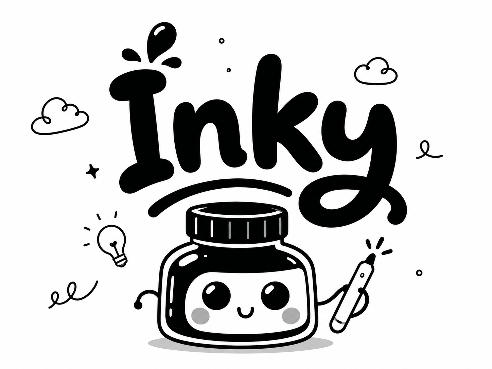
</p>

Start by generating a 12-panel storyboard from ChatGPT Images 2.0, or another image tool, then save it as the reference image for your animation.

Inky is a small canvas animation app for turning storyboard references into hand-drawn animated videos by a coding agent.

## Start With A 12-Panel Storyboard

First, generate a 12-panel storyboard from ChatGPT Images 2.0, or another image tool. Save that image as your reference image.

A good reference is usually:

- 12 panels in a clear grid, often `3 x 4` or `4 x 3`
- one main action broken into readable beats
- consistent character design across panels
- clear props, poses, facial expressions, and camera framing
- no need to be perfect; it is a lighthouse, not final art

Example storyboard used in this repo:

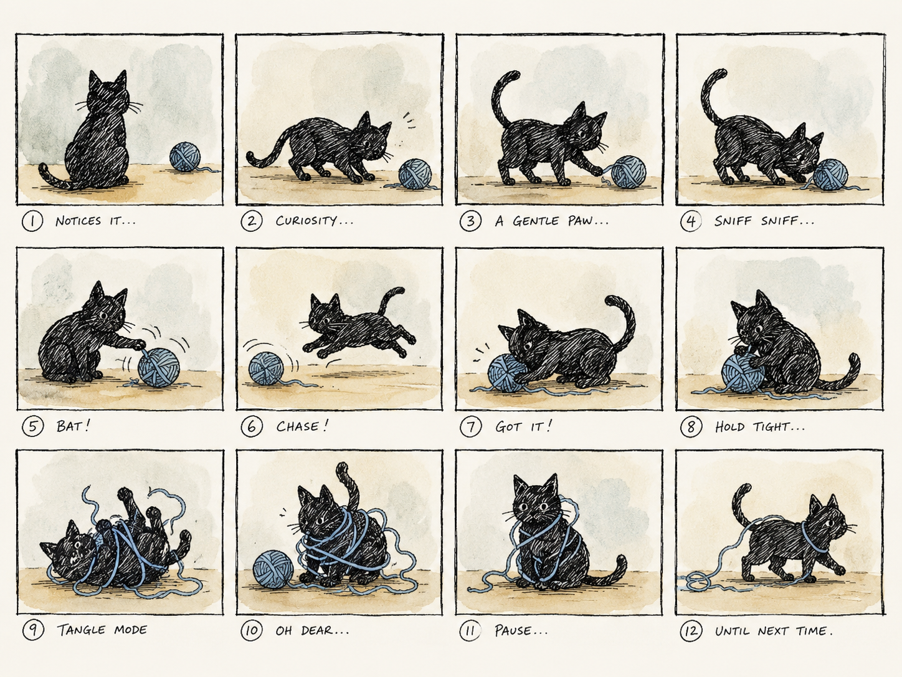

## Ask Your Coding Agent

Once you have the storyboard image, ask Codex, Claude, or another coding agent to build the animation from it.

Example prompt:

```text
Use this 12 panel storyboard and draw an animated scene with ink style and watercolour effects of this cat playing with yarn.

Create a new Inky project, use the storyboard as the lighthouse reference, extract the 12 frames, redraw the scene in code, animate the in-betweens, polish the frames, and make the browser preview/export work.
```

Other style prompts you can use:

```text
Use this 12 panel storyboard and animate a blond woman cutting fruit salad. Use waxy crayon fills and ink outlines.
```

```text
Use this 12 panel storyboard and animate a comic stick-man tax office scene with clean speech bubbles.
```

```text
Use this 12 panel storyboard and animate a clown juggling. Keep the baggy pants, hands, arms, and balls clear and remove storyboard-only guide arcs.
```

## What The Agent Does

The agent should work through the animation like a tiny 2D animation pipeline:

1. Create a new folder under `projects/<project-name>/`.
2. Save the original storyboard in `projects/<project-name>/image/`.
3. Extract the 12 panels into `projects/<project-name>/storyboard/`.
4. Write `requirements.md` with the requested style and fixes.
5. Create construction blueprints from the source panels.
6. Redraw the scene in canvas code using the storyboard as a lighthouse.
7. Remove storyboard-only marks such as panel numbers, borders, long guide arrows, and construction lines.
8. Animate between the panels with in-between frames.
9. Run polish checks for body connections, clothing clarity, props, speech bubbles, texture, and flicker.
10. Verify the browser preview and export controls.

The source image should guide pose, silhouette, timing, and texture direction. It should not be pasted into the final animation.

## Start In The Browser

Install and run the app:

```bash
npm install
npm run preview -- --port 5176
```

Open:

```text
http://127.0.0.1:5176/
```

Inky opens with no active animation. The first screen helps you create a new storyboard project:

1. Add a 12-panel storyboard image.
2. Choose grid: `3x4`, `4x3`, or custom.
3. Describe the animation style and fixes.
4. Create the project scaffold.
5. Use the generated project files with a coding agent.
6. Preview/export the finished animation.

After a project has been created or selected, the animation canvas and controls are the preview surface:

```text
http://127.0.0.1:5176/?project=cat-yarn-watercolor
```

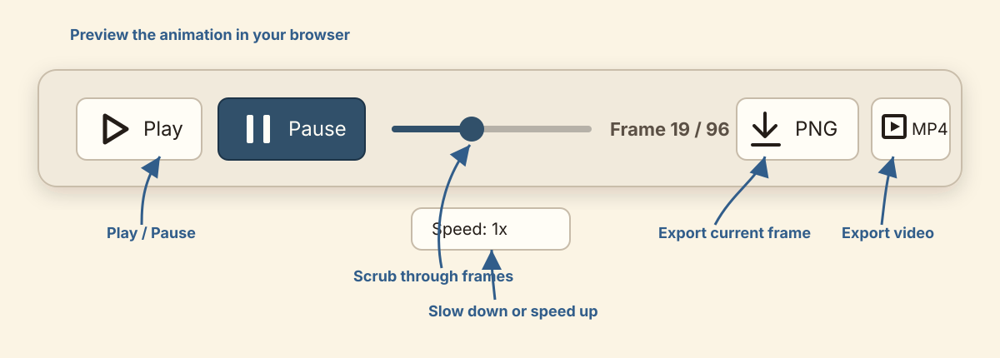

Use the browser controls to:

- **Play / Pause** the animation.
- **Scrub the timeline** to inspect individual frames.
- **Change speed** to slow down or speed up playback.
- **Export PNG** to save the current frame.
- **Export MP4** to download the video at the selected speed.

## Ask For Fixes

After the first version, you can ask for specific visual fixes.

Examples:

```text
The shorts do not connect to the body. Redraw the body chain so the shirt overlaps the waistband and the legs exit from the shorts.
```

```text
The speech bubble points to the wrong character. Fix the source bubble geometry and redraw it, do not patch over it.
```

```text
The crayon texture still feels flat. Use the material brush tools so the strokes have wax gaps, pressure changes, and visible direction.
```

The agent should fix the root cause and rerender. It should not cover bugs with white patches, eraser seams, hidden overlays, or extra texture.

## Example Projects

These projects show the original storyboard reference and a 12-panel storyboard made from the Inky drawn animation frames.

### Cat Playing With Yarn

Ink and watercolour-style animation.

| Original storyboard | Inky drawn animation storyboard |
| --- | --- |
|  | 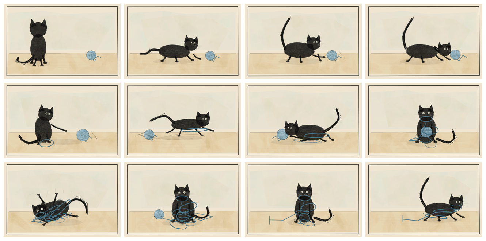 |

### Blond Fruit Salad

Waxy crayon fills with ink outlines.

| Original storyboard | Inky drawn animation storyboard |
| --- | --- |
| 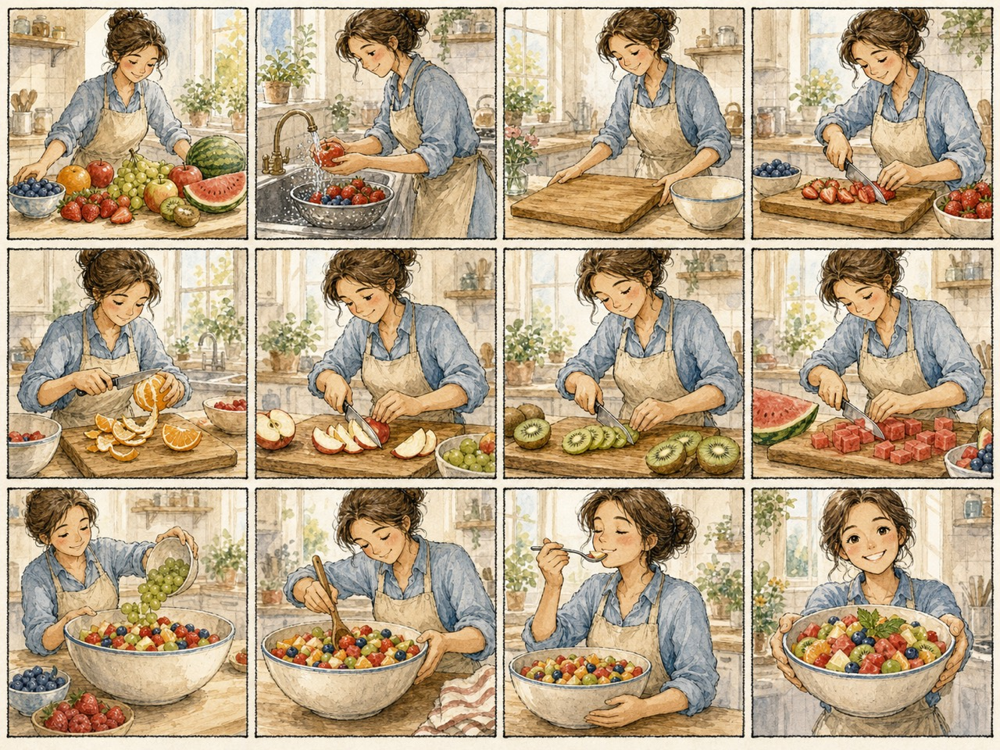 | 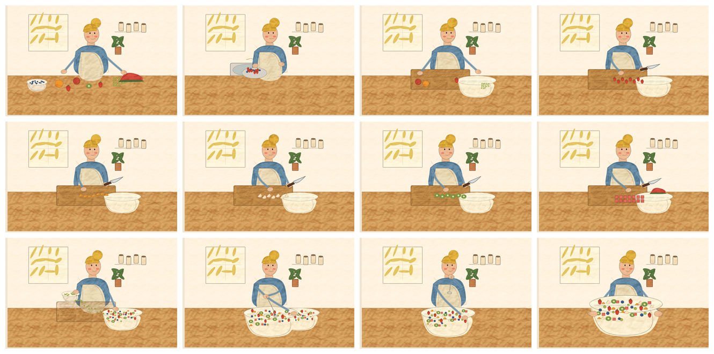 |

### Leafy Plant Rescue Comic

Modern comic animation with speech bubbles.

| Original storyboard | Inky drawn animation storyboard |
| --- | --- |
| 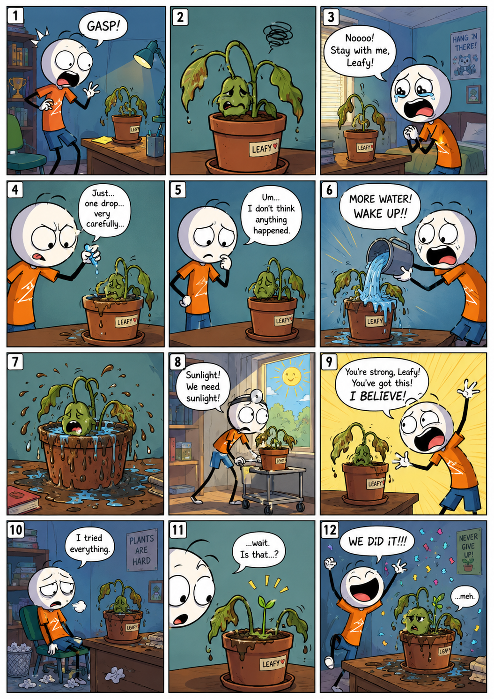 | 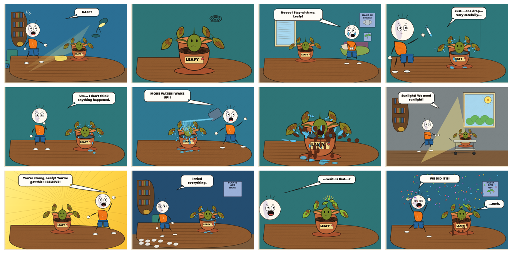 |

### Clown Juggling

Hand-drawn children’s book style with animated juggling.

| Original storyboard | Inky drawn animation storyboard |
| --- | --- |
| 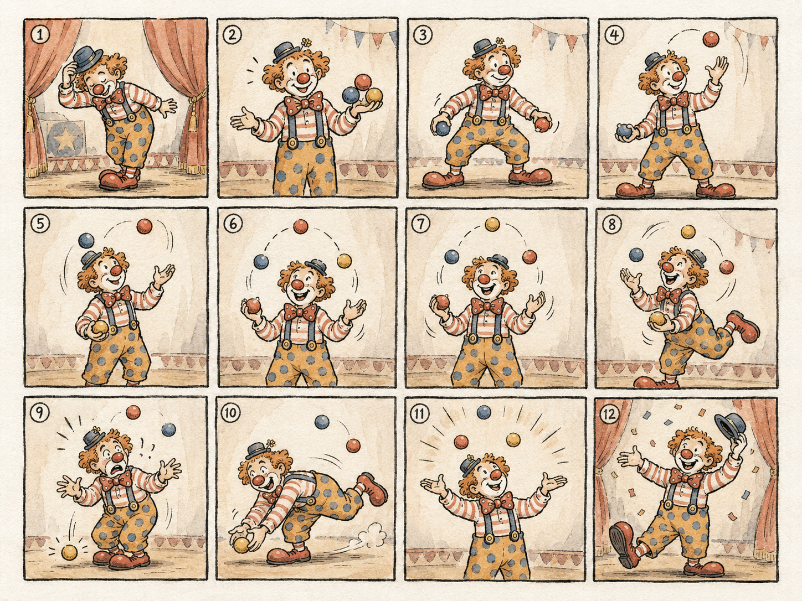 | 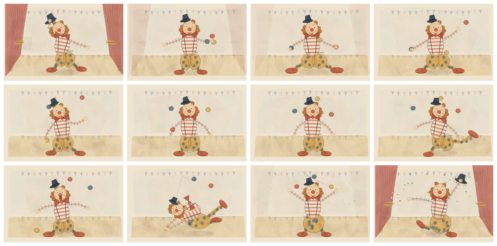 |

## Brush And Texture Tools

Inky includes reusable material tools in `src/material-tools.js`.

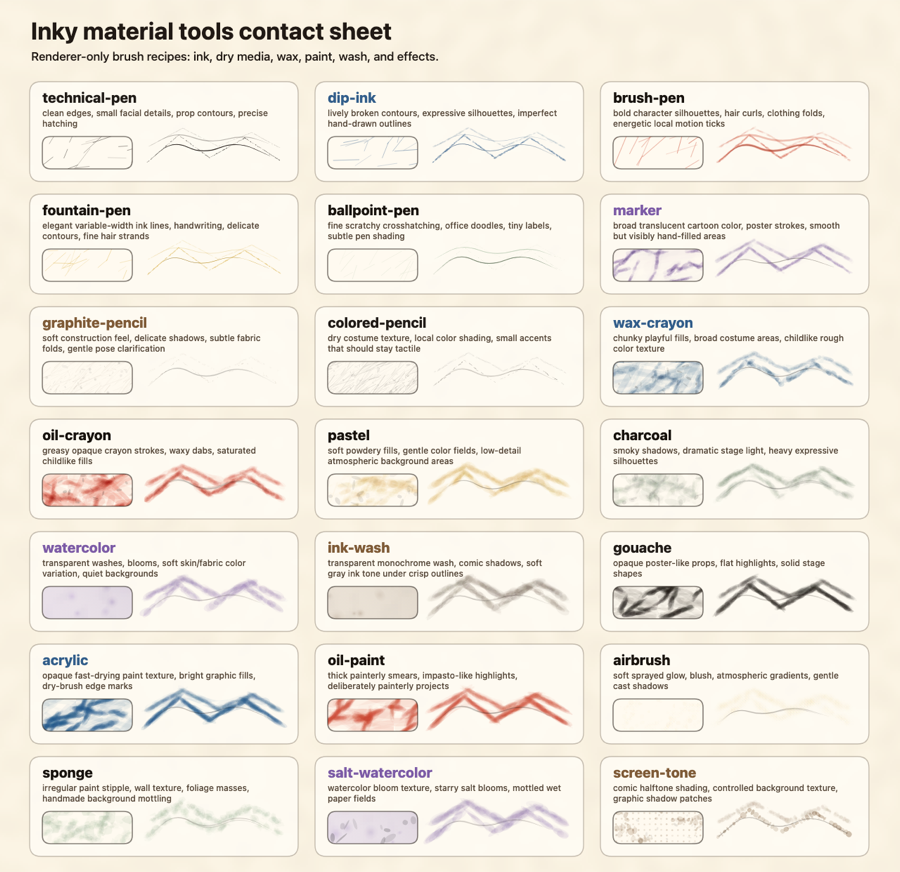

Use:

- `technical-pen` for crisp outlines and tiny details
- `dip-ink`, `fountain-pen`, or `brush-pen` for expressive ink lines
- `ballpoint-pen` for scratchy office-comic hatching
- `marker` for broad translucent cartoon fills
- `graphite-pencil` and `colored-pencil` for dry sketch texture
- `wax-crayon`, `oil-crayon`, and `pastel` for chunky hand-coloured fills
- `charcoal` for smoky shadows
- `watercolor`, `ink-wash`, and `salt-watercolor` for transparent washes and blooms
- `gouache`, `acrylic`, and `oil-paint` for opaque paint texture
- `airbrush`, `sponge`, and `screen-tone` for special effects

## Project Folders

Each animation project should live here:

```text
projects/<project-name>/
├── project.json  # source of truth for browser preview and render tools
├── image/       # original storyboard reference
├── prompt/      # user request and follow-up corrections
├── storyboard/  # extracted frames, requirements, ledgers, blueprints, in-betweens
├── renderer.js   # project-specific drawing code
└── outputs/     # rendered frames, contact sheets, reviews, videos
```

Create a project from the command line:

```bash
npm run new -- \
  --image ./storyboards/cat.png \
  --name cat-yarn-watercolor \
  --grid 3x4 \
  --prompt "Animate this cat playing with yarn in ink and watercolor."
```

Render a selected project after the preview app is running:

```bash
npm run render -- --project cat-yarn-watercolor --url http://127.0.0.1:5176/
```

## Contributing

Contributions are welcome. Please read `CONTRIBUTING.md` before opening a pull request.

For visual changes, include screenshots or notes from the browser preview so reviewers can see what changed.

## License

Inky is released under the MIT License. See `LICENSE` for details.
